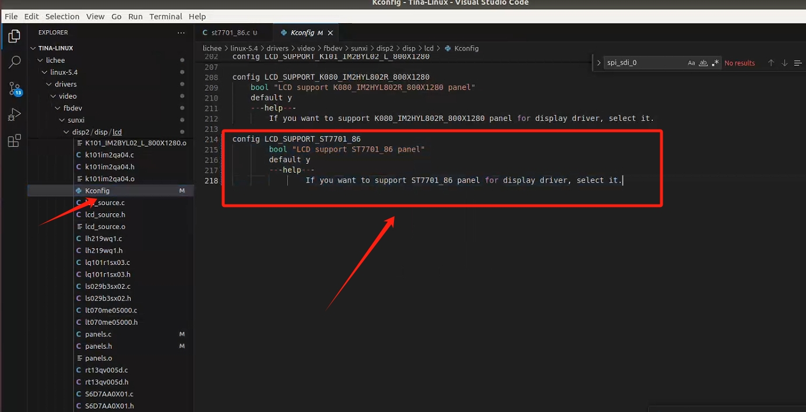
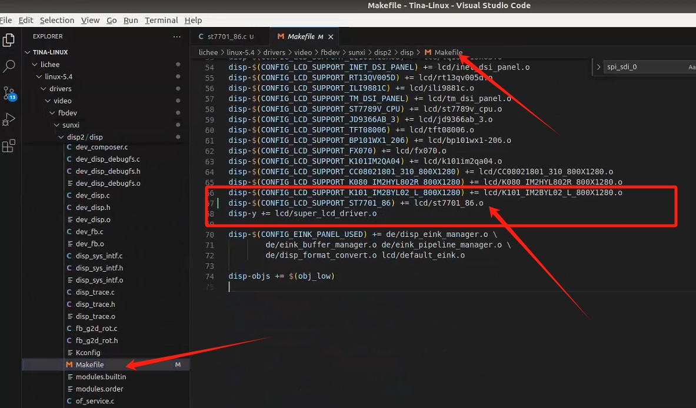
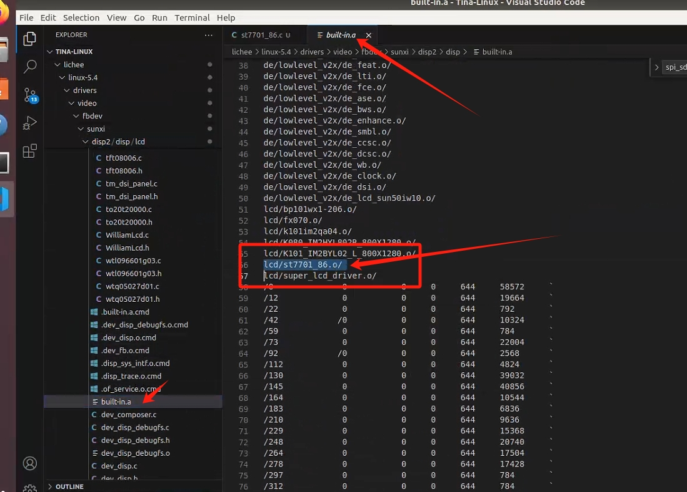
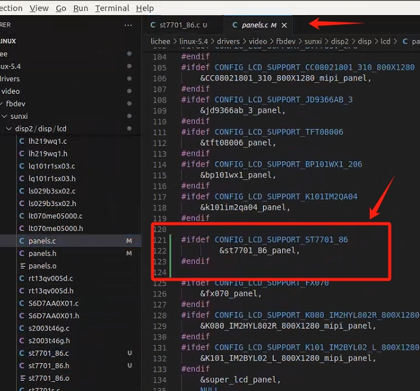
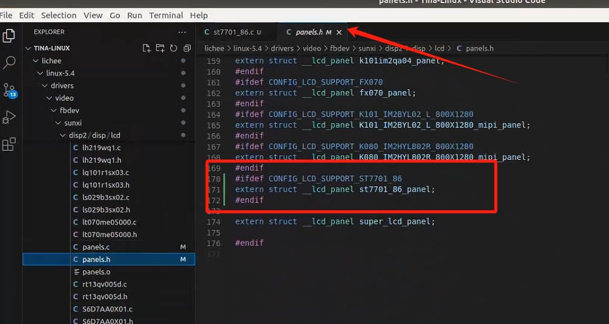
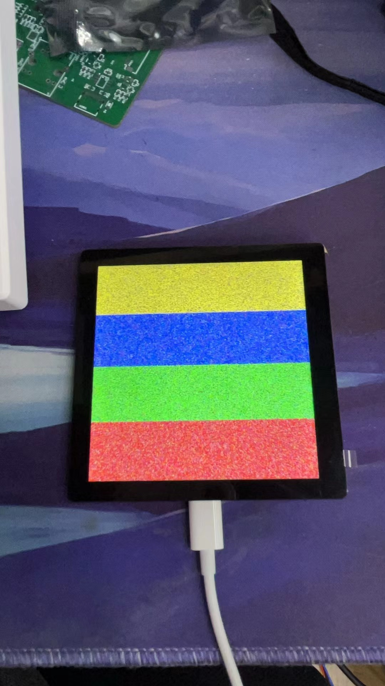

# T113驱动ST7701S RGB屏幕


# 添加屏幕驱动流程

## 1.添加驱动源码
如果要添加lcd驱动，添加位置如下：

```shell
/home/ubuntu/Tina-Linux/lichee/linux-5.4/drivers/video/fbdev/sunxi/disp2
```

## 2.配置kconfig和Makefile

同时配置目录下的Kconfig与Makefile，文件路径分别如下：

```shell
/home/ubuntu/Tina-Linux/lichee/linux-5.4/drivers/video/fbdev/sunxi/disp2/disp/lcd/Kconfig
/home/ubuntu/Tina-Linux/lichee/linux-5.4/drivers/video/fbdev/sunxi/disp2/disp/Makefile
```

### 2.1 kconfig

```txt
config LCD_SUPPORT_ST7701_86
        bool "LCD support ST7701_86 panel"
        default y
        ---help---
                If you want to support ST7701_86 panel for display driver, select it.
```



### 2.2 Makefile

```txt
disp-$(CONFIG_LCD_SUPPORT_ST7701_86) += lcd/st7701_86.o
```



### 2.3 built-in.a

这个文件需要添加我们刚才编译完的.o文件


```shell
lcd/st7701_86.o/
```




## 3.修改panels.c和panels.h


```shell
/home/ubuntu/Tina-Linux/lichee/linux-5.4/drivers/video/fbdev/sunxi/disp2/disp/lcd/panels.c
/home/ubuntu/Tina-Linux/lichee/linux-5.4/drivers/video/fbdev/sunxi/disp2/disp/lcd/panels.h
```

```C
#ifdef CONFIG_LCD_SUPPORT_ST7701_86
extern struct __lcd_panel st7701_86_panel;
#endif
```






## 4.修改dts

```dts
&lcd0 {
/* part 1 */
	lcd_used            = <1>;
	lcd_driver_name     = "st7701_86";
	lcd_backlight	    = <255>;

	/* part 2 */
	lcd_if = <0>;
	lcd_hv_if = <0>;
	
	/* part 3 */
	lcd_x               = <480>;
	lcd_y               = <480>;
	lcd_width           = <71>;
	lcd_height          = <71>;
	lcd_dclk_freq       = <16>;

	lcd_hbp             = <20>;
	lcd_ht              = <526>;
	lcd_hspw            = <6>;

	lcd_vbp             = <10>;
	lcd_vt              = <510>;
	lcd_vspw            = <4>;
		
	lcd_pwm_used        = <1>;
	lcd_pwm_ch          = <7>;
	lcd_pwm_freq        = <5000>;
	lcd_pwm_pol         = <0>;

	/* part 5 */
	lcd_frm = <1>;
	lcd_io_phase = <0x0000>;
	lcd_gamma_en = <0>;
	lcd_cmap_en = <0>;
	lcd_hv_clk_phase = <0>;
	lcd_hv_sync_polarity= <0>;

	// reset
	lcd_gpio_0 = <&pio PB 4 GPIO_ACTIVE_HIGH>;
	// cs
	lcd_gpio_1 = <&pio PB 7 GPIO_ACTIVE_HIGH>;
	// sda
	lcd_gpio_2 = <&pio PB 5 GPIO_ACTIVE_HIGH>;
	// sck
	lcd_gpio_3 = <&pio PB 6 GPIO_ACTIVE_HIGH>;

	//bl
	lcd_bl_en = <&pio PD 22 GPIO_ACTIVE_HIGH>;

	/* part 6 */
	lcd_power = "vcc-lcd";
	lcd_pin_power = "vcc-pd";
	pinctrl-0 = <&rgb18_pins_a>;
	pinctrl-1 = <&rgb18_pins_b>;
};
```


```dts
&disp {
	disp_init_enable         = <1>;
	disp_mode                = <0>;

	screen0_output_type      = <1>;
	screen0_output_mode      = <4>;

	screen1_output_type      = <3>;
	screen1_output_mode      = <10>;

	screen1_output_format    = <0>;
	screen1_output_bits      = <0>;
	screen1_output_eotf      = <4>;
	screen1_output_cs        = <257>;
	screen1_output_dvi_hdmi  = <2>;
	screen1_output_range     = <2>;
	screen1_output_scan      = <0>;
	screen1_output_aspect_ratio = <8>;

	dev0_output_type         = <1>;
	dev0_output_mode         = <4>;
	dev0_screen_id           = <0>;
	dev0_do_hpd              = <0>;

	dev1_output_type         = <4>;
	dev1_output_mode         = <10>;
	dev1_screen_id           = <1>;
	dev1_do_hpd              = <1>;

	def_output_dev           = <0>;
	hdmi_mode_check          = <1>;

	fb0_format               = <0>;
	fb0_width                = <0>;
	fb0_height               = <0>;

	fb1_format               = <0>;
	fb1_width                = <0>;
	fb1_height               = <0>;
	chn_cfg_mode             = <1>;

	disp_para_zone           = <1>;
	/*VCC-LCD*/
/*	dc1sw-supply = <&reg_pio3_3>;*/
	/*VCC-DSI*/
/*	eldo3-supply = <&reg_eldo3>;*/
	/*VCC-PD*/
/*	dcdc1-supply = <&reg_pio3_3>;*/
};
```


## 5.测试

```shell
root@TinaLinux:/# cat /dev/urandom > /dev/fb0
root@TinaLinux:/# echo 8 > /sys/class/disp/disp/attr/colorbar
```





## 6.驱动文件

驱动文件参考繁花cloud提供的sdk

st7701_86.c

```c
/*
 * drivers/video/fbdev/sunxi/disp2/disp/lcd/st7701_86/st7701_86.c
 *
 * Copyright (c) 2007-2018 Allwinnertech Co., Ltd.
 * Author: zhengxiaobin <zhengxiaobin@allwinnertech.com>
 *
 * This software is licensed under the terms of the GNU General Public
 * License version 2, as published by the Free Software Foundation, and
 * may be copied, distributed, and modified under those terms.
 *
 * This program is distributed in the hope that it will be useful,
 * but WITHOUT ANY WARRANTY; without even the implied warranty of
 * MERCHANTABILITY or FITNESS FOR A PARTICULAR PURPOSE.  See the
 * GNU General Public License for more details.
 *
[lcd0]
lcd_used            = 1
lcd_driver_name     = "st7701_86"
lcd_x               = 480
lcd_y               = 480
lcd_width           = 71
lcd_height          = 71
lcd_dclk_freq       = 30
lcd_pwm_used        = 1
lcd_pwm_ch          = 8
lcd_pwm_freq        = 50000
lcd_pwm_pol         = 0
lcd_pwm_max_limit   = 255
lcd_hbp             = 120
;10 + 20 + 10 + 240*3 = 760  real set 1000
lcd_ht              = 850
lcd_hspw            = 2
lcd_vbp             = 13
lcd_vt              = 373
lcd_vspw            = 2
lcd_frm             = 1
lcd_if              = 0
lcd_hv_if			= 8
lcd_hv_clk_phase    = 0
lcd_hv_sync_polarity   = 0
lcd_hv_srgb_seq		= 0
lcd_io_phase        = 0x0000
lcd_gamma_en        = 0
lcd_bright_curve_en = 1
lcd_cmap_en         = 0
lcd_rb_swap	= 0
deu_mode            = 0
lcdgamma4iep        = 22
smart_color         = 90
;lcd_bl_en           = port:PB03<1><0><default><1>
lcd_power           = "vcc-lcd"
lcd_pin_power           = "vcc-pd"
;reset
lcd_gpio_0          = port:PD09<1><0><default><1>
;cs
lcd_gpio_1          = port:PD10<1><0><default><0>
;sda
lcd_gpio_2          = port:PD13<1><0><default><0>
;sck
lcd_gpio_3          = port:PD12<1><0><default><0>
lcdd5                = port:PD03<2><0><2><default>
lcdd6                = port:PD04<2><0><2><default>
lcdd7                = port:PD05<2><0><2><default>
lcdd10               = port:PD06<2><0><2><default>
lcdd11               = port:PD07<2><0><2><default>
lcdd12               = port:PD08<2><0><2><default>
lcdclk              = port:PD18<2><0><3><default>
lcdde               = port:PD19<2><0><3><default>
lcdhsync            = port:PD20<2><0><3><default>
lcdvsync            = port:PD21<2><0><3><default>
[lcd0_suspend]
lcdd5                = port:PD03<7><0><2><default>
lcdd6                = port:PD04<7><0><2><default>
lcdd7                = port:PD05<7><0><2><default>
lcdd10               = port:PD06<7><0><2><default>
lcdd11               = port:PD07<7><0><2><default>
lcdd12               = port:PD08<7><0><2><default>
lcdclk              = port:PD18<7><0><3><default>
lcdde               = port:PD19<7><0><3><default>
lcdhsync            = port:PD20<7><0><3><default>
lcdvsync            = port:PD21<7><0><3><default>
 */
#include "st7701_86.h"

#define spi_scl_1 sunxi_lcd_gpio_set_value(0, 3, 1)
#define spi_scl_0 sunxi_lcd_gpio_set_value(0, 3, 0)
#define spi_sdi_1 sunxi_lcd_gpio_set_value(0, 2, 1)
#define spi_sdi_0 sunxi_lcd_gpio_set_value(0, 2, 0)
#define spi_cs_1 sunxi_lcd_gpio_set_value(0, 1, 1)
#define spi_cs_0 sunxi_lcd_gpio_set_value(0, 1, 0)

static void lcd_panel_st7701_86_init(void);
static void LCD_power_on(u32 sel);
static void LCD_power_off(u32 sel);
static void LCD_bl_open(u32 sel);
static void LCD_bl_close(u32 sel);

static void LCD_panel_init(u32 sel);
static void LCD_panel_exit(u32 sel);

static void LCD_cfg_panel_info(struct panel_extend_para *info)
{
	u32 i = 0, j = 0;
	u32 items;
	u8 lcd_gamma_tbl[][2] = {
	    /* {input value, corrected value} */
	    {0, 0},     {15, 15},   {30, 30},   {45, 45},   {60, 60},
	    {75, 75},   {90, 90},   {105, 105}, {120, 120}, {135, 135},
	    {150, 150}, {165, 165}, {180, 180}, {195, 195}, {210, 210},
	    {225, 225}, {240, 240}, {255, 255},
	};

	u32 lcd_cmap_tbl[2][3][4] = {
	    {
		{LCD_CMAP_G0, LCD_CMAP_B1, LCD_CMAP_G2, LCD_CMAP_B3},
		{LCD_CMAP_B0, LCD_CMAP_R1, LCD_CMAP_B2, LCD_CMAP_R3},
		{LCD_CMAP_R0, LCD_CMAP_G1, LCD_CMAP_R2, LCD_CMAP_G3},
	    },
	    {
		{LCD_CMAP_B3, LCD_CMAP_G2, LCD_CMAP_B1, LCD_CMAP_G0},
		{LCD_CMAP_R3, LCD_CMAP_B2, LCD_CMAP_R1, LCD_CMAP_B0},
		{LCD_CMAP_G3, LCD_CMAP_R2, LCD_CMAP_G1, LCD_CMAP_R0},
	    },
	};

	items = sizeof(lcd_gamma_tbl) / 2;
	for (i = 0; i < items - 1; i++) {
		u32 num = lcd_gamma_tbl[i + 1][0] - lcd_gamma_tbl[i][0];

		for (j = 0; j < num; j++) {
			u32 value = 0;

			value =
			    lcd_gamma_tbl[i][1] +
			    ((lcd_gamma_tbl[i + 1][1] - lcd_gamma_tbl[i][1]) *
			     j) /
				num;
			info->lcd_gamma_tbl[lcd_gamma_tbl[i][0] + j] =
			    (value << 16) + (value << 8) + value;
		}
	}
	info->lcd_gamma_tbl[255] = (lcd_gamma_tbl[items - 1][1] << 16) +
				   (lcd_gamma_tbl[items - 1][1] << 8) +
				   lcd_gamma_tbl[items - 1][1];

	memcpy(info->lcd_cmap_tbl, lcd_cmap_tbl, sizeof(lcd_cmap_tbl));
}

static s32 LCD_open_flow(u32 sel)
{
	/* open lcd power, and delay 50ms */
	LCD_OPEN_FUNC(sel, LCD_power_on, 200);
	/* open lcd power, than delay 200ms */
	LCD_OPEN_FUNC(sel, LCD_panel_init, 200);
	/* open lcd controller, and delay 100ms */
	LCD_OPEN_FUNC(sel, sunxi_lcd_tcon_enable, 150);
	/* open lcd backlight, and delay 0ms */
	LCD_OPEN_FUNC(sel, LCD_bl_open, 0);

	return 0;
}

static s32 LCD_close_flow(u32 sel)
{
	/* close lcd backlight, and delay 0ms */
	LCD_CLOSE_FUNC(sel, LCD_bl_close, 50);
	/* close lcd controller, and delay 0ms */
	LCD_CLOSE_FUNC(sel, sunxi_lcd_tcon_disable, 10);
	/* open lcd power, than delay 200ms */
	LCD_CLOSE_FUNC(sel, LCD_panel_exit, 10);
	/* close lcd power, and delay 500ms */
	LCD_CLOSE_FUNC(sel, LCD_power_off, 10);

	return 0;
}

static void LCD_power_on(u32 sel)
{
	/* config lcd_power pin to open lcd power0 */
	sunxi_lcd_power_enable(sel, 0);
	/* pwr_en, active low */
	sunxi_lcd_gpio_set_value(sel, 3, 0);
	sunxi_lcd_pin_cfg(sel, 1);
}

static void LCD_power_off(u32 sel)
{
	sunxi_lcd_pin_cfg(sel, 0);
	/* pwr_en, active low */
	sunxi_lcd_gpio_set_value(sel, 3, 1);
	/* config lcd_power pin to close lcd power0 */
	sunxi_lcd_power_disable(sel, 0);
}

static void LCD_bl_open(u32 sel)
{
	sunxi_lcd_pwm_enable(sel);
	/* config lcd_bl_en pin to open lcd backlight */
	sunxi_lcd_backlight_enable(sel);
}

static void LCD_bl_close(u32 sel)
{
	/* config lcd_bl_en pin to close lcd backlight */
	sunxi_lcd_backlight_disable(sel);
	sunxi_lcd_pwm_disable(sel);
}

static void st7701_86_spi_write_cmd(u8 value)
{

    int i;
    spi_cs_0;
    spi_sdi_0;
    spi_scl_0;
    sunxi_lcd_delay_us(10);
    spi_scl_1;
    for (i = 0; i < 8; i++) {
        sunxi_lcd_delay_us(10);
        if (value & 0x80)
            spi_sdi_1;
        else
            spi_sdi_0;
        spi_scl_0;
        sunxi_lcd_delay_us(10);
        spi_scl_1;
        value <<= 1;
    }
    sunxi_lcd_delay_us(10);
    spi_cs_1;
}

static void st7701_86_spi_write_data(u8 value)
{

    int i;
    spi_cs_0;
    spi_sdi_1;
    spi_scl_0;
    sunxi_lcd_delay_us(10);
    spi_scl_1;
    for (i = 0; i < 8; i++) {
        sunxi_lcd_delay_us(10);
        if (value & 0x80)
            spi_sdi_1;
        else
            spi_sdi_0;
        value <<= 1;
        sunxi_lcd_delay_us(10);
        spi_scl_0;
        spi_scl_1;
    }
    sunxi_lcd_delay_us(10);
    spi_cs_1;
}

static void LCD_panel_init(u32 sel)
{
	struct disp_panel_para *info =
	    kmalloc(sizeof(struct disp_panel_para), GFP_KERNEL | __GFP_ZERO);
	bsp_disp_get_panel_info(sel, info);
	lcd_panel_st7701_86_init();
	kfree(info);
	return;
}

static void LCD_panel_exit(u32 sel)
{
	struct disp_panel_para *info =
	    kmalloc(sizeof(struct disp_panel_para), GFP_KERNEL | __GFP_ZERO);
	st7701_86_spi_write_cmd(0x28);
	st7701_86_spi_write_cmd(0x10);
	sunxi_lcd_delay_ms(300);
	bsp_disp_get_panel_info(sel, info);
	kfree(info);
	return;
}

static void lcd_panel_st7701_86_init(void)
{
	/* VCI=3.3V */
	/************* Reset LCD Driver ****************/
	spi_cs_0;
	sunxi_lcd_gpio_set_value(0, 0, 1);
	sunxi_lcd_delay_ms(50);
	sunxi_lcd_gpio_set_value(0, 0, 0);
	/* Delay 10ms, This delay time is necessary */
	sunxi_lcd_delay_ms(100);
	sunxi_lcd_gpio_set_value(0, 0, 1);
	/* Delay 120 ms */
	sunxi_lcd_delay_ms(150);

	/******************************************************************************/
	st7701_86_spi_write_cmd(0xFF);
	st7701_86_spi_write_data(0x77);
	st7701_86_spi_write_data(0x01);
	st7701_86_spi_write_data(0x00);
	st7701_86_spi_write_data(0x00);
	st7701_86_spi_write_data(0x13);
	st7701_86_spi_write_cmd(0xEF);
	st7701_86_spi_write_data(0x08);
	st7701_86_spi_write_cmd(0xFF);
	st7701_86_spi_write_data(0x77);
	st7701_86_spi_write_data(0x01);
	st7701_86_spi_write_data(0x00);
	st7701_86_spi_write_data(0x00);
	st7701_86_spi_write_data(0x10);
	st7701_86_spi_write_cmd(0xC0);
	st7701_86_spi_write_data(0x3B);
	st7701_86_spi_write_data(0x00);

	st7701_86_spi_write_cmd(0xC1);
	st7701_86_spi_write_data(0x0D);
	st7701_86_spi_write_data(0x02);

	st7701_86_spi_write_cmd(0xC2);
	st7701_86_spi_write_data(0x21);
	st7701_86_spi_write_data(0x08);

	st7701_86_spi_write_cmd(
		0xC3); //配置工作模式为DE模式，供应商给的驱动源码并没有设置该 地址 。
	st7701_86_spi_write_data(
		0x02); // 0X02 The data is input on the negative edge of DOTCLK
	st7701_86_spi_write_data(0x02);
	st7701_86_spi_write_data(0x00);

	st7701_86_spi_write_cmd(0xCD);
	st7701_86_spi_write_data(
		0x08); //18-bit/pixel: MDT=0:D[21:16]=R,D[13:8]=G,D[5:0]=B(CDH=00) ;

	//              MDT=1:D[17:12]=R,D[11:6]=G,D[5:0]=B(CDH=08) ;

	st7701_86_spi_write_cmd(0xB0);
	st7701_86_spi_write_data(0x00);
	st7701_86_spi_write_data(0x11);
	st7701_86_spi_write_data(0x18);
	st7701_86_spi_write_data(0x0E);
	st7701_86_spi_write_data(0x11);
	st7701_86_spi_write_data(0x06);
	st7701_86_spi_write_data(0x07);
	st7701_86_spi_write_data(0x08);
	st7701_86_spi_write_data(0x07);
	st7701_86_spi_write_data(0x22);
	st7701_86_spi_write_data(0x04);
	st7701_86_spi_write_data(0x12);
	st7701_86_spi_write_data(0x0F);
	st7701_86_spi_write_data(0xAA);
	st7701_86_spi_write_data(0x31);
	st7701_86_spi_write_data(0x18);
	st7701_86_spi_write_cmd(0xB1);
	st7701_86_spi_write_data(0x00);
	st7701_86_spi_write_data(0x11);
	st7701_86_spi_write_data(0x19);
	st7701_86_spi_write_data(0x0E);
	st7701_86_spi_write_data(0x12);
	st7701_86_spi_write_data(0x07);
	st7701_86_spi_write_data(0x08);
	st7701_86_spi_write_data(0x08);
	st7701_86_spi_write_data(0x08);
	st7701_86_spi_write_data(0x22);
	st7701_86_spi_write_data(0x04);
	st7701_86_spi_write_data(0x11);
	st7701_86_spi_write_data(0x11);
	st7701_86_spi_write_data(0xA9);
	st7701_86_spi_write_data(0x32);
	st7701_86_spi_write_data(0x18);
	st7701_86_spi_write_cmd(0xFF);
	st7701_86_spi_write_data(0x77);
	st7701_86_spi_write_data(0x01);
	st7701_86_spi_write_data(0x00);
	st7701_86_spi_write_data(0x00);
	st7701_86_spi_write_data(0x11);
	st7701_86_spi_write_cmd(0xB0);
	st7701_86_spi_write_data(0x60);
	st7701_86_spi_write_cmd(0xB1);
	st7701_86_spi_write_data(0x30);
	st7701_86_spi_write_cmd(0xB2);
	st7701_86_spi_write_data(0x87);
	st7701_86_spi_write_cmd(0xB3);
	st7701_86_spi_write_data(0x80);
	st7701_86_spi_write_cmd(0xB5);
	st7701_86_spi_write_data(0x49);
	st7701_86_spi_write_cmd(0xB7);
	st7701_86_spi_write_data(0x85);
	st7701_86_spi_write_cmd(0xB8);
	st7701_86_spi_write_data(0x21);
	st7701_86_spi_write_cmd(0xC1);
	st7701_86_spi_write_data(0x78);
	st7701_86_spi_write_cmd(0xC2);
	st7701_86_spi_write_data(0x78);
	sunxi_lcd_delay_ms(20);
	st7701_86_spi_write_cmd(0xE0);
	st7701_86_spi_write_data(0x00);
	st7701_86_spi_write_data(0x1B);
	st7701_86_spi_write_data(0x02);
	st7701_86_spi_write_cmd(0xE1);
	st7701_86_spi_write_data(0x08);
	st7701_86_spi_write_data(0xA0);
	st7701_86_spi_write_data(0x00);
	st7701_86_spi_write_data(0x00);
	st7701_86_spi_write_data(0x07);
	st7701_86_spi_write_data(0xA0);
	st7701_86_spi_write_data(0x00);
	st7701_86_spi_write_data(0x00);
	st7701_86_spi_write_data(0x00);
	st7701_86_spi_write_data(0x44);
	st7701_86_spi_write_data(0x44);
	st7701_86_spi_write_cmd(0xE2);
	st7701_86_spi_write_data(0x11);
	st7701_86_spi_write_data(0x11);
	st7701_86_spi_write_data(0x44);
	st7701_86_spi_write_data(0x44);
	st7701_86_spi_write_data(0xED);
	st7701_86_spi_write_data(0xA0);
	st7701_86_spi_write_data(0x00);
	st7701_86_spi_write_data(0x00);
	st7701_86_spi_write_data(0xEC);
	st7701_86_spi_write_data(0xA0);
	st7701_86_spi_write_data(0x00);
	st7701_86_spi_write_data(0x00);
	st7701_86_spi_write_cmd(0xE3);
	st7701_86_spi_write_data(0x00);
	st7701_86_spi_write_data(0x00);
	st7701_86_spi_write_data(0x11);
	st7701_86_spi_write_data(0x11);
	st7701_86_spi_write_cmd(0xE4);
	st7701_86_spi_write_data(0x44);
	st7701_86_spi_write_data(0x44);
	st7701_86_spi_write_cmd(0xE5);
	st7701_86_spi_write_data(0x0A);
	st7701_86_spi_write_data(0xE9);
	st7701_86_spi_write_data(0xD8);
	st7701_86_spi_write_data(0xA0);
	st7701_86_spi_write_data(0x0C);
	st7701_86_spi_write_data(0xEB);
	st7701_86_spi_write_data(0xD8);
	st7701_86_spi_write_data(0xA0);
	st7701_86_spi_write_data(0x0E);
	st7701_86_spi_write_data(0xED);
	st7701_86_spi_write_data(0xD8);
	st7701_86_spi_write_data(0xA0);
	st7701_86_spi_write_data(0x10);
	st7701_86_spi_write_data(0xEF);
	st7701_86_spi_write_data(0xD8);
	st7701_86_spi_write_data(0xA0);
	st7701_86_spi_write_cmd(0xE6);
	st7701_86_spi_write_data(0x00);
	st7701_86_spi_write_data(0x00);
	st7701_86_spi_write_data(0x11);
	st7701_86_spi_write_data(0x11);
	st7701_86_spi_write_cmd(0xE7);
	st7701_86_spi_write_data(0x44);
	st7701_86_spi_write_data(0x44);
	st7701_86_spi_write_cmd(0xE8);
	st7701_86_spi_write_data(0x09);
	st7701_86_spi_write_data(0xE8);
	st7701_86_spi_write_data(0xD8);
	st7701_86_spi_write_data(0xA0);
	st7701_86_spi_write_data(0x0B);
	st7701_86_spi_write_data(0xEA);
	st7701_86_spi_write_data(0xD8);
	st7701_86_spi_write_data(0xA0);
	st7701_86_spi_write_data(0x0D);
	st7701_86_spi_write_data(0xEC);
	st7701_86_spi_write_data(0xD8);
	st7701_86_spi_write_data(0xA0);
	st7701_86_spi_write_data(0x0F);
	st7701_86_spi_write_data(0xEE);
	st7701_86_spi_write_data(0xD8);
	st7701_86_spi_write_data(0xA0);
	st7701_86_spi_write_cmd(0xEB);
	st7701_86_spi_write_data(0x02);
	st7701_86_spi_write_data(0x00);
	st7701_86_spi_write_data(0xE4);
	st7701_86_spi_write_data(0xE4);
	st7701_86_spi_write_data(0x88);
	st7701_86_spi_write_data(0x00);
	st7701_86_spi_write_data(0x40);
	st7701_86_spi_write_cmd(0xEC);
	st7701_86_spi_write_data(0x3C);
	st7701_86_spi_write_data(0x00);
	st7701_86_spi_write_cmd(0xED);
	st7701_86_spi_write_data(0xAB);
	st7701_86_spi_write_data(0x89);
	st7701_86_spi_write_data(0x76);
	st7701_86_spi_write_data(0x54);
	st7701_86_spi_write_data(0x02);
	st7701_86_spi_write_data(0xFF);
	st7701_86_spi_write_data(0xFF);
	st7701_86_spi_write_data(0xFF);
	st7701_86_spi_write_data(0xFF);
	st7701_86_spi_write_data(0xFF);
	st7701_86_spi_write_data(0xFF);
	st7701_86_spi_write_data(0x20);
	st7701_86_spi_write_data(0x45);
	st7701_86_spi_write_data(0x67);
	st7701_86_spi_write_data(0x98);
	st7701_86_spi_write_data(0xBA);
	st7701_86_spi_write_cmd(0xEF);
	st7701_86_spi_write_data(0x10);
	st7701_86_spi_write_data(0x0D);
	st7701_86_spi_write_data(0x04);
	st7701_86_spi_write_data(0x08);
	st7701_86_spi_write_data(0x3F);
	st7701_86_spi_write_data(0x1F);
	st7701_86_spi_write_cmd(0xFF);
	st7701_86_spi_write_data(0x77);
	st7701_86_spi_write_data(0x01);
	st7701_86_spi_write_data(0x00);
	st7701_86_spi_write_data(0x00);
	st7701_86_spi_write_data(0x00);

	st7701_86_spi_write_cmd(0x3A);
	st7701_86_spi_write_data(
		0x66); //55/50=16bit(RGB565);66=18bit(RGB666);77?????3AH?=24bit(RGB888)

	st7701_86_spi_write_cmd(0xFF);
	st7701_86_spi_write_data(0x77);
	st7701_86_spi_write_data(0x01);
	st7701_86_spi_write_data(0x00);
	st7701_86_spi_write_data(0x00);
	st7701_86_spi_write_data(0x13);
	st7701_86_spi_write_cmd(0xE8);
	st7701_86_spi_write_data(0x00);
	st7701_86_spi_write_data(0x0E);
	st7701_86_spi_write_cmd(0xFF);
	st7701_86_spi_write_data(0x77);
	st7701_86_spi_write_data(0x01);
	st7701_86_spi_write_data(0x00);
	st7701_86_spi_write_data(0x00);
	st7701_86_spi_write_data(0x00);

	st7701_86_spi_write_cmd(0xFF);
	st7701_86_spi_write_data(0x77);
	st7701_86_spi_write_data(0x01);
	st7701_86_spi_write_data(0x00);
	st7701_86_spi_write_data(0x00);
	st7701_86_spi_write_data(0x13);
	st7701_86_spi_write_cmd(0xE8);
	st7701_86_spi_write_data(0x00);
	st7701_86_spi_write_data(0x0C);
	sunxi_lcd_delay_ms(10);
	st7701_86_spi_write_cmd(0xE8);
	st7701_86_spi_write_data(0x00);
	st7701_86_spi_write_data(0x00);

	st7701_86_spi_write_cmd(0xFF);
	st7701_86_spi_write_data(0x77);
	st7701_86_spi_write_data(0x01);
	st7701_86_spi_write_data(0x00);
	st7701_86_spi_write_data(0x00);
	st7701_86_spi_write_data(0x00);

	st7701_86_spi_write_cmd(0x35);
	st7701_86_spi_write_data(0x00); //TE ON

	st7701_86_spi_write_cmd(0x36);
	st7701_86_spi_write_data(0x08); //FW:00     BW:10

	st7701_86_spi_write_cmd(0x21);

	///////////////BIST////////////////
	// st7701_86_spi_write_cmd(0xFF);
	// st7701_86_spi_write_data(0x77);
	// st7701_86_spi_write_data(0x01);
	// st7701_86_spi_write_data(0x00);
	// st7701_86_spi_write_data(0x00);
	// st7701_86_spi_write_data(0x12);
	// st7701_86_spi_write_cmd(0xD1);
	// st7701_86_spi_write_data(0x81);
	// st7701_86_spi_write_cmd(0xD2);
	// st7701_86_spi_write_data(0x06);

	st7701_86_spi_write_cmd(0x11);
	sunxi_lcd_delay_ms(120);

	st7701_86_spi_write_cmd(0x29);
	sunxi_lcd_delay_ms(120);
}

/* sel: 0:lcd0; 1:lcd1 */
static s32 LCD_user_defined_func(u32 sel, u32 para1, u32 para2, u32 para3)
{
	return 0;
}

struct __lcd_panel st7701_86_panel = {
    /* panel driver name, must mach the name of lcd_drv_name in sys_config.fex
       */
	.name = "st7701_86",
	.func = {
		.cfg_panel_info = LCD_cfg_panel_info,
		.cfg_open_flow = LCD_open_flow,
		.cfg_close_flow = LCD_close_flow,
		.lcd_user_defined_func = LCD_user_defined_func,
		},
};

```


st7701_86.h

```h
/*
 * drivers/video/fbdev/sunxi/disp2/disp/lcd/st7789v/st7789v.h
 *
 * Copyright (c) 2007-2018 Allwinnertech Co., Ltd.
 * Author: zhengxiaobin <zhengxiaobin@allwinnertech.com>
 *
 * This software is licensed under the terms of the GNU General Public
 * License version 2, as published by the Free Software Foundation, and
 * may be copied, distributed, and modified under those terms.
 *
 * This program is distributed in the hope that it will be useful,
 * but WITHOUT ANY WARRANTY; without even the implied warranty of
 * MERCHANTABILITY or FITNESS FOR A PARTICULAR PURPOSE.  See the
 * GNU General Public License for more details.
 *
 */
#ifndef __ST7701_86_PANEL_H__
#define __ST7701_86_PANEL_H__

#include "panels.h"

extern struct __lcd_panel st7701_86_panel;

#endif


```