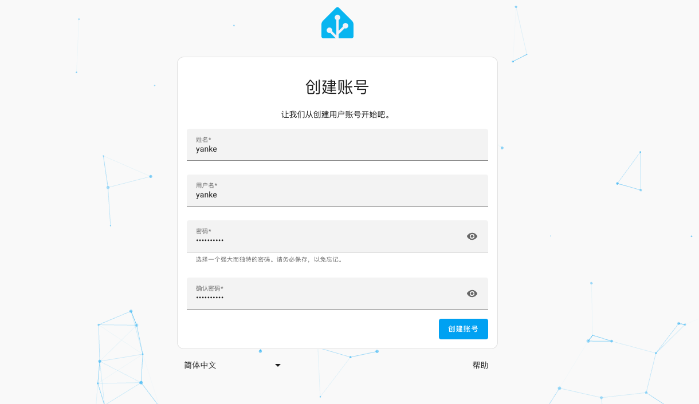

# 安装homeassistant

## 1.拉取镜像
```shell
docker pull homeassistant/home-assistant 
```

我们需要创建一个配置文件，我设置在这里：

```shell
pi@raspberrypi:~ $ mkdir homeassistant
pi@raspberrypi:~ $ ls
Bookshelf                    Desktop    homeassistant  ncnn      Templates
cpolar                       Documents  Music          Pictures  tfam1dcnn
cpolar-stable-linux-arm.zip  Downloads  myenv          Public    Videos
pi@raspberrypi:~ $ cd homeassistant/
pi@raspberrypi:~/homeassistant $ pwd
/home/pi/homeassistant
pi@raspberrypi:~/homeassistant $ 
```


## 2.启动homeassistant
```shell
docker run -d --name="home-assistants" -v /[你的本地存放该容器配置路径]:/config -p 8123:8123 homeassistant/home-assistant
```

注意，上面的PATH_TO_YOUR_CONFIG就是我们刚才配置的目录

```shell
docker run -d --name="home-assistants" -v /home/pi/homeassistant:/config -p 8123:8123 homeassistant/home-assistant
```

* docker run: 运行 Docker 容器的命令。
* -d 或 --detach: 将容器放入后台运行。
* --name="home-assistant": 为容器指定一个名称，这里是 "home-assistants"。
* -v /home/pi/homeassistant:/config: 将宿主机中的 /home/pi/homeassistant 目录挂载到容器中的 /config 目录。这样做是为了将 Home * Assistant 的配置文件持久化，以便在容器重新启动时保留配置。
* --net=host: 将容器与主机共享网络命名空间，使容器能够直接访问主机的网络设置。
* homeassistant/home-assistant: 指定要使用的容器镜像，这里是 Home Assistant 的最新版本。


访问树莓派IP:8123即可

