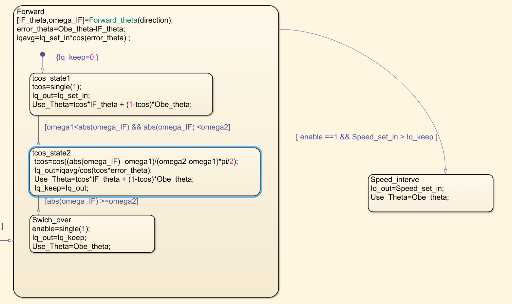

# 基于IF角速度的切换策略

### 基于余弦的切换策略
$$
tcos=\left\{\begin{matrix}
  1& , \omega_{if} \le  \omega_{1}\\
 cos(\frac{\omega_{if}-\omega_{1}}{\omega_{2}-\omega_{1}} \times \frac{\pi }{2} ) & , \omega_{1} \le  \omega_{if} \le \omega_{2}\\
 0 & ,\omega_{2} \le  \omega_{if}

\end{matrix}\right.
$$

$$
\theta =tcos * \theta _{if}+(1-tcos)*\theta _{obe}
$$

其中$\omega_{1}$和$\omega_{2}$就是我们要切换的速度区间。

在IF开环拉的时候，IQ的计算公式如下：
$$
iq_{avg} = iq_{set} * cos(\theta _{obe} - \theta _{if}) \\
iq_{out} = \frac{iq_{avg}}{cos(tcos*(\theta _{obe} - \theta _{if}))}
$$

参考的stateflow如下
