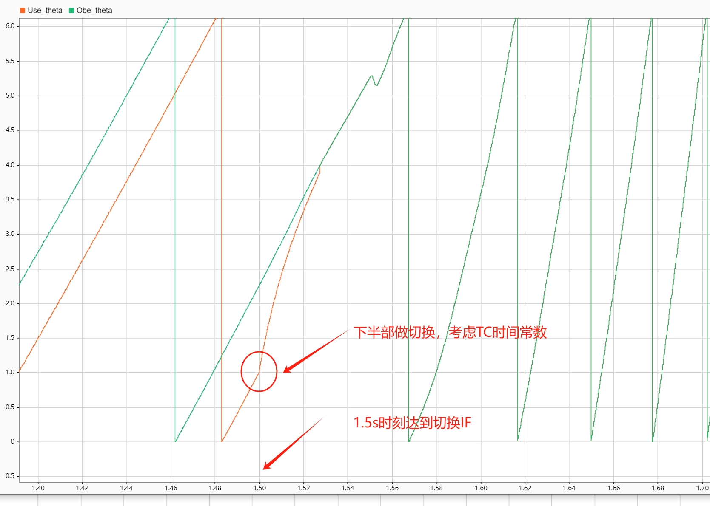

# 基于时间的开环强托策略


### IF启动中的theta角度
为了满足park与anti-park的角度需求，我们这里是人为造了一个角度。在实际的IF启动中，我们会对常数进行积分，得到omega，然后在积分一次，得到theta角度。做两次积分主要是保障升速用的。对于一些低转速的电机，这个常数c不要超过100

### 转子预定位及启动
1. $i_{d}$=0，设定$i_{q}$=$i_{q}^{*}$
2. 另$i_{q}$=$i_{q}^{*}$的同时，保持一段时间
3. 设定常数c,让常数c积分得到omega，在积分得到$\theta$

### 基于时间的切换补偿
升速的过程由常量C控制，电机在IF工况下速度达到15%~20%，此时切换带来的负面影响最小。在IF运行至观测器收敛后，一般2s到3s就足够了。同时，在切换前0.1s内的任意时刻，记录dq轴的q轴电流值：
$$
q_{real} = iq \times cos(\hat{\theta _{e}} -\theta _{e}^{*} )
$$
其中$\hat{\theta _{e}}$是观测器的值，$\theta _{e}^{*}$是IF的值


当达到切换时间时，IF输出的$\theta^{*}$到观测器输出的$\hat{\theta}$在切换的时候，我们使用惯性环节去做：$\frac{1}{Tc*s+1}$

假设这里我们的关系环节是 $\frac{1}{0.01*s+1}$，我们可以使用matlab进行离散化
```matlab
sys=tf(1,[0.01 1])
zh = c2d(sys,0.0001,'zoh') %我们系统是10k
[num,den]=tfdata(zh,'v')
```

在电流环节IF切换的惯性环节，要合理考虑TC，让切换在下半部

