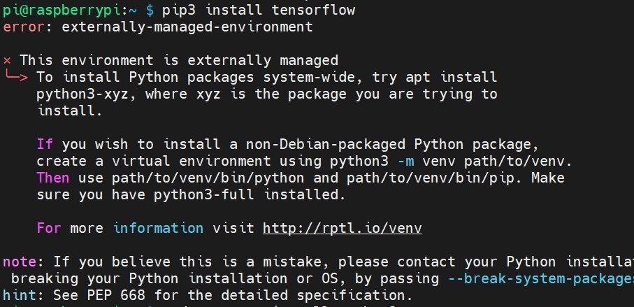

# 树莓派如何安装tensorflow

由于os限制，我们不能直接pip安装TensorFlow，会出现如下错误
```shell
sudo apt install libatlas-base-dev
pip3 install tensorflow
```


所以我们需要建立一个虚拟的python环境
```shell
# 安装python3-venv包，如果还没安装的话
sudo apt install python3-venv

# 创建一个新的虚拟环境
python3 -m venv myenv

# 激活虚拟环境
source myenv/bin/activate

# 现在你可以在虚拟环境中安装tensorflow
pip3 install tensorflow

```
当你完成了工作并想要退出虚拟环境时，只需运行 deactivate 命令。

