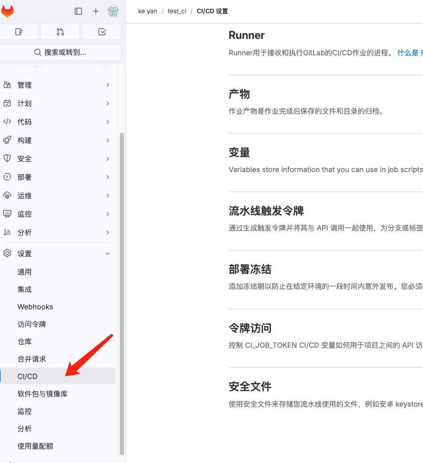

# Runner安装与使用

## 1.如何安装runner
打开项目，设置-CICD就可以找到Runner相关介绍


接下来，按照提示，注册runner
```shell
gitlab-runner register  --url https://gitlab.com  --token glrt-Yyz8m6Lwz8iKy9CmoATr
```

执行如下命令即可看到runner
```shell
gitlab-runner run
```

runner出意外执行步骤：
```shell
gitlab-runner stop
gtilab-runner start
gitlab-runner run
```

## 2.基本使用

### runner配置文件目录
```shell
~/.gitlab-runner/config.toml
```

## 常见的gitlab-runner命令
```
gitlab-runner restart 
```