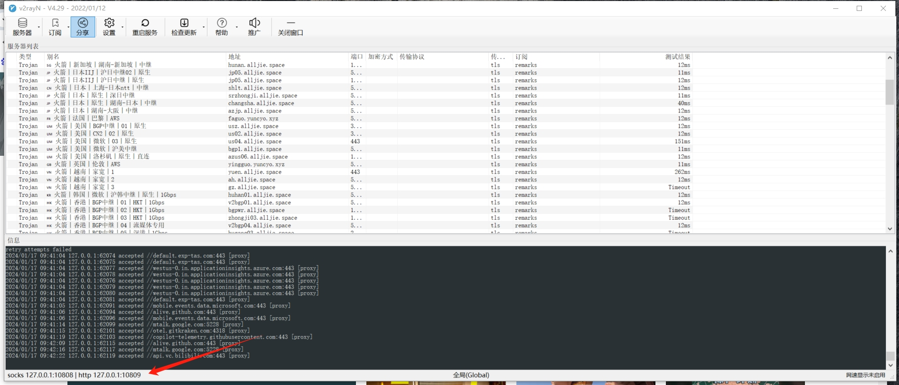

# GIT使用

### 1.当前分支代码保存到另一分支
1. 当前分支暂存修改
```git
git stash save '1111'
```
2. 切换分支
```
git checkout -b feature/c3
git stash pop
```
3. 回到主分支
```
git checkout master
```

### 2.windows v2ray git bash代理配置
首先查看v2ray底部的代理地址，记得开**全局代理**

配置git
```shell
git config --global http.proxy socks5://127.0.0.1:10808
git config --global https.proxy socks5://127.0.0.1:10808
git config --global http.proxy http://127.0.0.1:10809
git config --global https.proxy https://127.0.0.1:10809
```

如果取消代理的话：
```shell
git config --global --unset http.proxy
git config --global --unset https.proxy
```

可以使用如下指令查看配置：
```shell
git config -l
```

是否生效使用如下指令
```shell
$ ssh -T git@github.com
Hi YanKE01! You've successfully authenticated, but GitHub does not provide shell access.
```

如果发现不行，请添加443端口
```shell
nano ~/.ssh/config
```
```shell
Host github.com
 Hostname ssh.github.com
 Port 443
```

### 3.git使得ignore重新生效：

```shell
git rm -r --cached .
```


### 4.切换commit

```shell
gcor a2d76ad38a
```


### 5.怎么生成补丁

如果你只想生成工作区或暂存区的改动，而不包括提交记录，可以使用 git diff：
```shell
git diff > my_changes.patch
```

### 6.怎么commit的时候用vscode

```shell
git config --global core.editor "code --wait"
```

### 7.git 怎么修改分支名字
```shell
git branch -m 新的分支名称
```