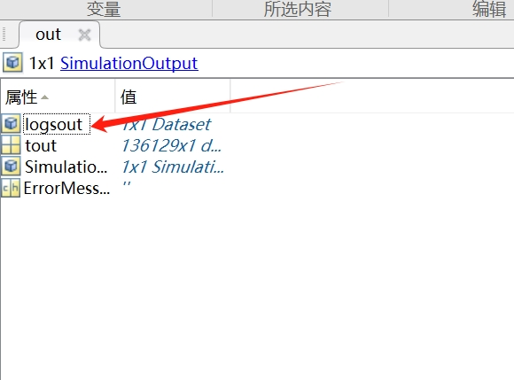

# simwindfarm问题总结

### 1.创建风电场提示matlab并行错误
运行 create_windfarm.m代码，提示matlab 新版本缺少matlabpool，改用parpool

修改create_windfield.m代码

修改前：
```matlab
if(~error)
    parallel=questdlg('Do you want to use Matlab parallel computation framwork?','Wind farm creator','Yes','No',{'No'});
    h=matlabpool('size');
    switch(parallel)
        case 'Yes'
            if(h==0)
                matlabpool('open');
            end
        otherwise
            if(h~=0)
                matlabpool('close');
            end
    end
    defdesc{1}=['Mean:' num2str(U0) ' m/s Turbulence: ' num2str(Ti) ' SimTime:' num2str(SimTime) ];
    desc=inputdlg('Enter wind field description','Wind Farm Creator',1,defdesc);
    if(isempty(desc))
        desc=defdesc{1};
    end
    wind=gen_windfield(U0,Ti,d,Lx,Ly,SimTime,desc);
    pause(1)
    [file,path]=uiputfile('*.mat','Save wind field as','mywind.mat');
    if ~(isequal(file,0) || isequal(path,0))
        save([path file],'wind');
    end
    wfgen=true;
    break;
end
```

修改后：
```matlab
if(~error)
    parallel=questdlg('Do you want to use Matlab parallel computation framwork?','Wind farm creator','Yes','No',{'No'});
    % h=matlabpool('size');
    % switch(parallel)
    %     case 'Yes'
    %         if(h==0)
    %             matlabpool('open');
    %         end
    %     otherwise
    %         if(h~=0)
    %             matlabpool('close');
    %         end
    % end

    if isempty(gcp('nocreate'))
        parpool;
    end
    defdesc{1}=['Mean:' num2str(U0) ' m/s Turbulence: ' num2str(Ti) ' SimTime:' num2str(SimTime) ];
    desc=inputdlg('Enter wind field description','Wind Farm Creator',1,defdesc);
    if(isempty(desc))
        desc=defdesc{1};
    end
    wind=gen_windfield(U0,Ti,d,Lx,Ly,SimTime,desc);
    pause(1)
    [file,path]=uiputfile('*.mat','Save wind field as','mywind.mat');
    if ~(isequal(file,0) || isequal(path,0))
        save([path file],'wind');
    end
    wfgen=true;
    break;
end
```

主要是这块代码：
```m
if isempty(gcp('nocreate'))
    parpool;
end
```

参考：[matlab parpool问题](https://blog.csdn.net/chentianting/article/details/88693526?spm=1001.2014.3001.5506)

### 2.Post processing模块中，出图时出现logsout未定义问题：
右键模块属性，查看回调，查看OpenFcn回调，发现出图调用的函数
```matlab
fatigue=fatiguegui(logsout);
```
在我们自己生成的环境中，logsout变量在out结构下：


修改回调函数代码即可
```matlab
fatigue=fatiguegui(out.logsout);
```


### 3.Post processing模块中Fatigue Computation没有出现疲劳载荷评估设置界面
查看fatiguegui.m文件，发现设置部分代码注释

```matlab
%qs={'Turbine #','Racetrack ratio','Unbinned Cycle Multiplier','Rainflow period [s]','Average Rayleigh wind speed [m/s]','Minimum Rayleigh wind speed [m/s]','Rayleigh delta wind speed [m/s]'};
%answer={'1','0.05','.5','300','10','5','.5'};
% fatparm=inputdlg(qs,'Fatigue Computation',1,answer,options);
% config.wt=str2double(fatparm{1});
% config.FiltRatio=str2double(fatparm{2});
% config.UCMult=str2double(fatparm{3});
% config.RF_Per=str2double(fatparm{4});
% config.RayAverWS=str2double(fatparm{5});
% config.WSmin=str2double(fatparm{6});
% config.WSdel=str2double(fatparm{7});
%config=struct();
%fatparm=inputdlg(qs,'Fatigue Computation',1,answer,options);
     config.DoLife=1;
     config.DoSimpDEL=1;
     config.BinCycles=1;
     config.BinMeans=0;
     config.PltBinCyc=0;
     config.PltRngMean=0;
     config.PltCumCyc=1;%»­ÓêÁ÷Ñ­»·µÄͼ
     config.PltProbExc=0;
     config.wt=1;
     config.FiltRatio=0.05;
     config.UCMult=5;
     config.RF_Per=300;
     config.RayAverWS=10;
     config.WSmin=5;
     config.WSdel=5;

```

取消注释即可：
```matlab
qs={'Turbine #','Racetrack ratio','Unbinned Cycle Multiplier','Rainflow period [s]','Average Rayleigh wind speed [m/s]','Minimum Rayleigh wind speed [m/s]','Rayleigh delta wind speed [m/s]'};
answer={'1','0.05','.5','300','10','5','.5'};
fatparm=inputdlg(qs,'Fatigue Computation',1,answer,options);
config.wt=str2double(fatparm{1});
config.FiltRatio=str2double(fatparm{2});
config.UCMult=str2double(fatparm{3});
config.RF_Per=str2double(fatparm{4});
config.RayAverWS=str2double(fatparm{5});
config.WSmin=str2double(fatparm{6});
config.WSdel=str2double(fatparm{7});
config=struct();
fatparm=inputdlg(qs,'Fatigue Computation',1,answer,options);
     config.DoLife=1;
     config.DoSimpDEL=1;
     config.BinCycles=1;
     config.BinMeans=0;
     config.PltBinCyc=0;
     config.PltRngMean=0;
     config.PltCumCyc=1;%»­ÓêÁ÷Ñ­»·µÄͼ
     config.PltProbExc=0;
     config.wt=1;
     config.FiltRatio=0.05;
     config.UCMult=5;
     config.RF_Per=300;
     config.RayAverWS=10;
     config.WSmin=5;
     config.WSdel=5;
```